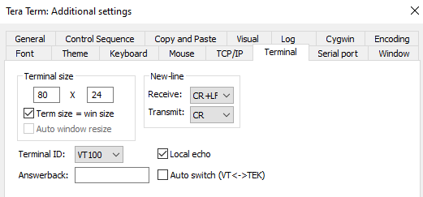
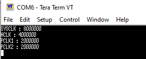

# STM32 Clock Configuration (HSE)

This project demonstrates how to configure the STM32 system clock (SYSCLK) using an external oscillator (HSE) and verify the clock tree frequencies by transmitting them to a PC terminal via UART.

## 🎯 Project Goal
* Switch the system clock source from HSI (Internal 16MHz RC) to **HSE (External 8MHz)**.
* Configure the AHB Prescaler to divide SYSCLK by 2, resulting in an **HCLK of 4MHz**.
* Verify SYSCLK, HCLK, PCLK1, and PCLK2 frequencies via UART output.

## ⚙️ Configuration & Settings

### 1. Clock Configuration (Firmware)
| Clock Parameter | Value | Description |
| :--- | :--- | :--- |
| **SYSCLK** | 8 MHz | Derived directly from HSE (8MHz / 1). |
| **HCLK** (AHB) | 4 MHz | AHB Prescaler = 2. |
| **PCLK1** (APB1)| 2 MHz | APB1 Prescaler = 2. |
| **PCLK2** (APB2)| 2 MHz | APB2 Prescaler = 2. |

### 2. Serial Port Settings
The UART peripheral is configured for **9600 baud rate**.
* **Speed:** 9600 bps
* **Data:** 8 bit
* **Parity:** none
* **Stop bits:** 1 bit

### 3. Terminal Settings
**Local echo** is enabled to view transmitted data if needed, though this application primarily sends data *from* the MCU.
* **Receive:** CR+LF
* **Local echo:** Checked

---

## 📊 Verification & Results

The application successfully configures the clock tree and transmits the internal frequency values read by HAL functions to the terminal.

### Terminal Output
As shown in the output below, the MCU is running at the expected 8MHz SYSCLK and 4MHz HCLK.
* **SYSCLK:** 8000000 Hz (8 MHz)
* **HCLK:** 4000000 Hz (4 MHz)
* **PCLK1:** 2000000 Hz (2 MHz)
* **PCLK2:** 2000000 Hz (2 MHz)

---

## 📝 Important Notes
* **HSE Configuration:** Although the STM32F407 Discovery board has an onboard 8 MHz crystal (normally requiring `RCC_HSE_ON`), this project was tested and verified to also work in `RCC_HSE_BYPASS` mode. The firmware is currently configured to use **HSE Bypass** mode for demonstration purposes.
* **SysTick:** The SysTick timer is reconfigured after the clock change to ensure correct 1ms delay timing.
