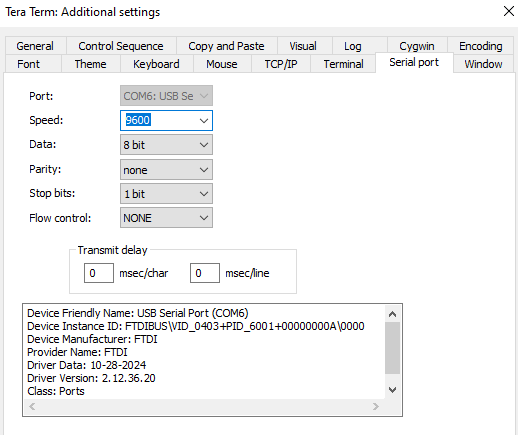
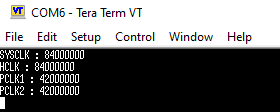
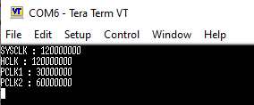

# STM32 Clock Configuration (HSI/PLL)

This project demonstrates how to configure the STM32F4xx system clock (SYSCLK) to multiple frequencies (50MHz, 84MHz, and 120MHz) using the internal 16MHz HSI oscillator as the input source for the main PLL.

## 🎯 Project Goal
* To use the **16MHz HSI RC** oscillator as a stable PLL source.
* To create a flexible `SystemClockConfig` function that can set the system clock to 50, 84, or 120 MHz.
* To verify the final HCLK, PCLK1, and PCLK2 frequencies for each setting by printing them to a terminal via UART.

## ⚙️ General Configuration
* **PLL Input:** 16 MHz (HSI)
* **UART:** Configured to 9600 bps for verification output.

---

## 📊 Verification & Results

The system clock is calculated using the formula:
**`PLLCLK = (HSI / M) * N`**
**`SYSCLK = PLLCLK / P`**

The `main.c` code is set to one of the configurations below by changing the define in `SystemClockConfig()`. Each setting was tested and verified.

### Case 1: 50 MHz Configuration
* **PLLM:** 16
* **PLLN:** 100
* **PLLP:** 2
* *(Formula: (16MHz / 16) * 100 / 2 = 50 MHz)*
* **Result:** The system correctly reports 50MHz SYSCLK/HCLK.

### Case 2: 84 MHz Configuration
* **PLLM:** 16
* **PLLN:** 168
* **PLLP:** 2
* *(Formula: (16MHz / 16) * 168 / 2 = 84 MHz)*
* **Result:** The system correctly reports 84MHz SYSCLK/HCLK.

### Case 3: 120 MHz Configuration
* **PLLM:** 16
* **PLLN:** 240
* **PLLP:** 2
* *(Formula: (16MHz / 16) * 240 / 2 = 120 MHz)*
* **Result:** The system correctly reports 120MHz SYSCLK/HCLK.

---

### Reference: STM32 Clock Tree
This diagram shows the general clock paths, including the HSI input to the PLL.

## 📝 Firmware Overview
* **`SystemClockConfig(uint8_t clock_freq)`**: A switch-case function that configures all necessary PLL (M, N, P) and bus (AHB, APB) prescalers based on the desired frequency.
* **`main()`**: Calls the `SystemClockConfig()` with one of the predefined frequencies, initializes UART, and transmits the resulting clock values.
