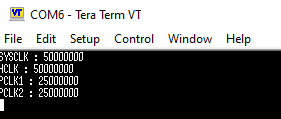
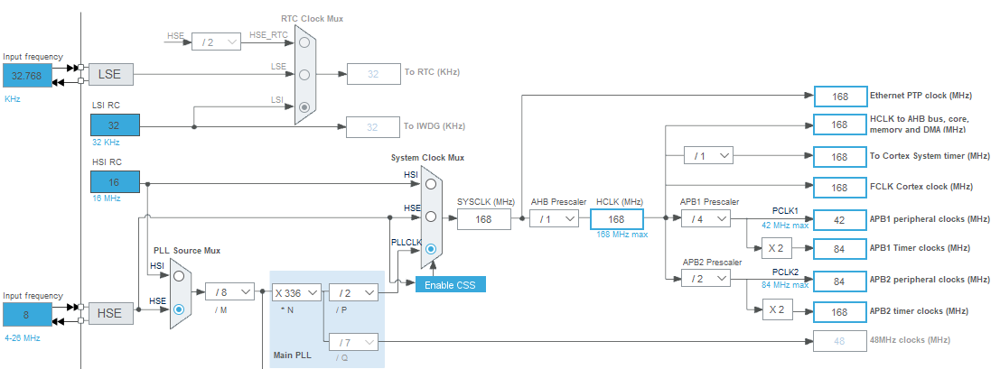

# STM32 Clock Configuration (HSE/PLL)

This project demonstrates how to configure the STM32F4xx system clock (SYSCLK) to multiple frequencies (50MHz, 84MHz, and 120MHz) using an **8MHz external oscillator (HSE)** as the input source for the main PLL.

## 🎯 Project Goal
* To use an **8MHz external clock source (HSE)** to drive the PLL.
* To implement a flexible `SystemClockConfig_HSE` function capable of setting the system to 50, 84, or 120 MHz.
* To verify the resulting HCLK, PCLK1, and PCLK2 frequencies by transmitting them via UART to a PC terminal.

## ⚙️ General Configuration
* **PLL Source:** HSE (8 MHz)
* **HSE Mode:** Bypass (Suitable for Nucleo boards using ST-LINK MCO as clock source)
* **UART:** 9600 baud rate for debug output.

---

## 📊 Verification & Results

The system clock is derived using the formula:
**`PLLCLK = (HSE / M) * N`**
**`SYSCLK = PLLCLK / P`**

The firmware can be configured to one of the following frequencies by modifying the parameter passed to `SystemClockConfig_HSE()` in `main.c`.

### Case 1: 50 MHz Configuration
* **PLLM:** 8
* **PLLN:** 100
* **PLLP:** 2
* *(Formula: (8MHz / 8) * 100 / 2 = 50 MHz)*
* **Result:** The system correctly reports 50MHz SYSCLK/HCLK.

### Case 2: 84 MHz Configuration
* **PLLM:** 8
* **PLLN:** 168
* **PLLP:** 2
* *(Formula: (8MHz / 8) * 168 / 2 = 84 MHz)*
* **Result:** The system correctly reports 84MHz SYSCLK/HCLK.

### Case 3: 120 MHz Configuration
* **PLLM:** 8
* **PLLN:** 240
* **PLLP:** 2
* *(Formula: (8MHz / 8) * 240 / 2 = 120 MHz)*
* **Result:** The system correctly reports 120MHz SYSCLK/HCLK.

---

### Reference: STM32 Clock Tree
The diagram below illustrates the clock path from the HSE input through the PLL to the system clock.

## 📝 Important Notes
* **HSE Bypass Mode:** The code uses `RCC_HSE_BYPASS`. If you are using a board with a dedicated crystal (like STM32F4 Discovery), you may need to change this to `RCC_HSE_ON`.
* **Flash Latency:** The `SystemClockConfig_HSE` function automatically adjusts the Flash wait states (Latency) based on the selected frequency to ensure stable operation.