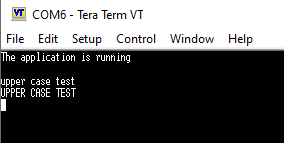

# UART2 Communication Example (Polling Mode)

This project demonstrates basic data transmission via the UART2 peripheral on an STM32F4xx microcontroller using the polling method.

## 🛠 Hardware & Software
* **MCU:** STM32F407
* **IDE:** STM32CubeIDE
* **Terminal Software:** Tera Term
* **Logic Analyzer:** Saleae Logic

## ⚙️ UART Configuration
* **Baud Rate:** 9600 bps
* **Word Length:** 8 Bits
* **Stop Bits:** 1
* **Parity:** None
* **Mode:** Asynchronous
* **Pins:** PA2 (TX) / PA3 (RX) - Alternate Function 7 (AF7)

---

## 📊 Test Results & Verification

The project has been verified both at the application level (terminal output) and at the physical signal level (logic analyzer).

### 1. Terminal Output (Tera Term)
Validates that the data string sent by the MCU is correctly received and decoded by the PC.

### 2. Signal Analysis (Logic Analyzer)
Verifies the UART protocol timing, baud rate accuracy, and frame structure (Start/Stop bits) at the physical layer.

---

## 📝 Notes
* The standard `HAL_UART_Transmit` function is used in blocking (polling) mode for simplicity.
* The logic analyzer probe was connected to the PA2 (TX) pin for signal capturing.
