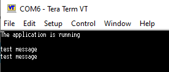

# UART Communication Example (Interrupt Mode)

This application demonstrates **non-blocking** UART communication on an STM32 microcontroller using Interrupts. It receives a string of characters from a PC terminal byte-by-byte via interrupts, buffers them, and echoes the complete string back when a Carriage Return (`\r`) is detected.

## 🚀 Key Features
* **Non-Blocking Reception:** Uses `HAL_UART_Receive_IT` to receive data without halting the main CPU execution.
* **Interrupt Handling:** Utilizes standard STM32 HAL callbacks (`HAL_UART_RxCpltCallback`) to process received data asynchronously.
* **Echo Functionality:** Buffers received characters and transmits them back exactly as received upon pressing Enter.

## ⚙️ Configuration & Settings

### 1. Serial Port Settings
The UART2 peripheral is configured for **9600 baud rate**, 8 data bits, 1 stop bit, and no parity.

### 2. Terminal Settings
**Local echo** is enabled to see typed characters.
* **Receive:** CR+LF
* **Transmit:** CR

---

## 📊 Test Results & Verification

### Terminal Output
The application sends a start message. When the user types `"test message"` and presses Enter, the MCU triggers an interrupt for each character, stores them, and finally echoes back `"test message"` exactly as received.

### Logic Analyzer Signal View
Physical signal capture of the UART TX line (Channel D0) verifying the 9600 baud rate timing during transmission.

---

## 📝 Firmware Overview

* **`main()`**: Initializes HAL and UART. Starts the non-blocking reception loop. The main loop continuously ensures the interrupt reception is active until the complete line is received.
* **`USART2_IRQHandler()`** *(in it.c)*: The hardware interrupt service routine that handles UART events and calls the standard HAL interrupt handler.
* **`HAL_UART_RxCpltCallback()`**: The user callback function executed automatically when a byte is received. It checks for the `\r` character to determine if the transmission is complete.
