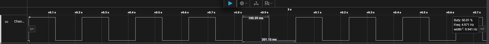
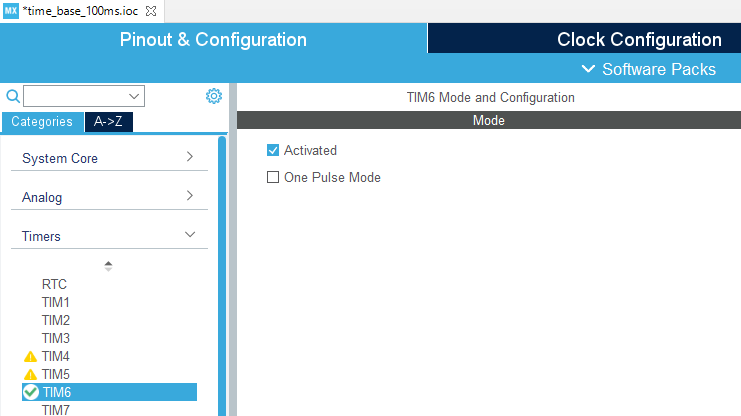

# STM32 Basic Timer (TIM6) Time Base - 100ms Polling

This project demonstrates how to configure a basic timer (TIM6) to generate a precise 100ms time base. The application uses this time base to toggle a GPIO pin in polling mode and verifies the timing with a logic analyzer.

## 🎯 Project Goal
* Configure TIM6 to overflow and set an update event flag every 100ms.
* Use the default **16 MHz HSI** as the timer clock source.
* Manually **poll** the timer's Status Register (SR) in a loop instead of using an interrupt handler.
* Toggle a GPIO pin (PD15) every time the flag is set.

## ⚙️ Configuration & Calculation

The timer clock source (TIM6CLK) is derived from the APB1 bus. With the default HSI (16MHz) clock and an APB1 prescaler of 1, the TIM6CLK is **16 MHz**.

The goal is a 100ms update period.

1.  **Counter Clock (CK_CNT) Calculation:**
    `CK_CNT = TIM_CLK / (PSC + 1)`
    `CK_CNT = 16,000,000 / (24 + 1)` = 640,000 Hz

2.  **Period (ARR) Calculation:**
    `Update Event = CK_CNT / (ARR + 1)`
    `100 ms = (ARR + 1) / 640,000 Hz`
    `ARR + 1 = 0.1 s * 640,000 Hz` = 64,000
    `ARR = 63999`

* **Prescaler (PSC):** 24
* **Auto-Reload (ARR):** 63999 (64000-1 in code)

---

## 📝 Firmware Overview

The `main.c` file implements a **polling-based** solution.

* **`TIM6_Init()`**: Configures the TIM6 `Instance` with the calculated `Prescaler` (24) and `Period` (63999).
* **`HAL_TIM_Base_Start(&htimer6)`**: Starts the timer counter.
* **`while(1)` Loop**:
    1.  `while( ! (TIM6->SR & TIM_SR_UIF) );`: The CPU **waits** in this loop until the Update Interrupt Flag (UIF) bit in the TIM6 Status Register (SR) is set by hardware.
    2.  `TIM6->SR = 0;`: The flag is **manually cleared by software** to allow the timer to count up to the next event.
    3.  `HAL_GPIO_TogglePin(...)`: The GPIO pin is toggled.

---

## 📊 Verification & Results

The application's timing was verified using a logic analyzer connected to the GPIO pin (PD15).

### Logic Analyzer Output
The output confirms the GPIO pin toggles precisely every **100.05 ms**. This results in a stable square wave with a 50% duty cycle and a total period of **200.15 ms** (approx. 4.997 Hz).

### Reference: Timer Configuration
The basic timer (TIM6) is activated in the CubeMX configuration.

This datasheet snippet describes the TIM6 basic timer as a 16-bit auto-reload up-counter.
