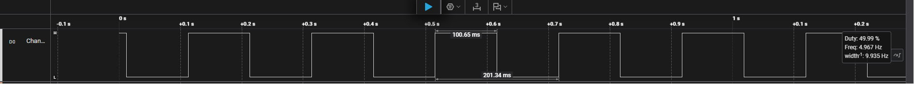
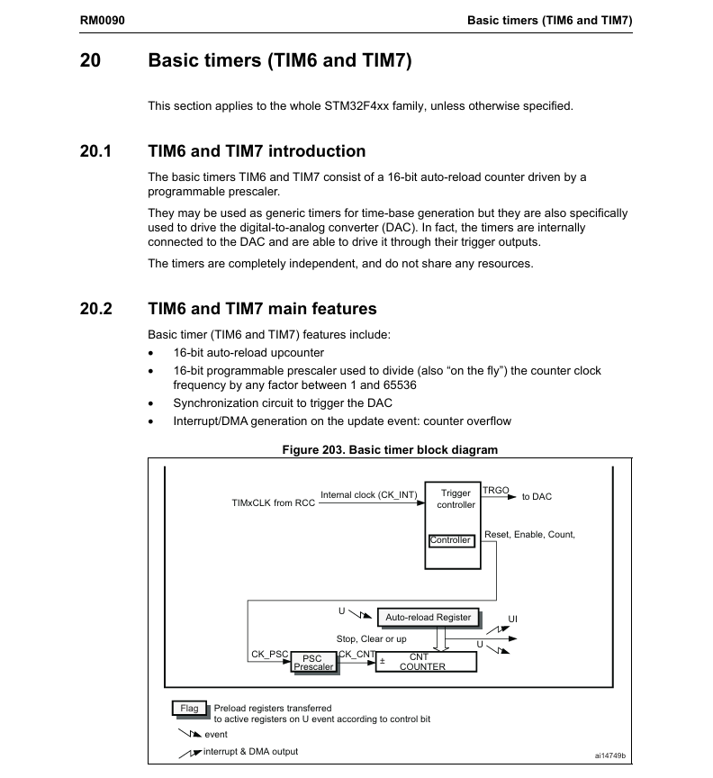

# STM32 Basic Timer (TIM6) Time Base - 100ms Interrupt

This project demonstrates an efficient, non-blocking method for generating a 100ms time base using the TIM6 basic timer and interrupts. This is the interrupt-based evolution of the previous polling project.

## 🎯 Project Goal
* Configure TIM6 to trigger an **Update Event Interrupt** every 100ms.
* Use the default **16 MHz HSI** as the timer clock source.
* Handle the timing event inside a callback function (`HAL_TIM_PeriodElapsedCallback`), keeping the main `while(1)` loop free.
* Toggle a GPIO pin (PD15) within the callback to verify timing.

## 💡 Key Features: Polling vs. Interrupt
This interrupt-based design is far more efficient than the previous polling method.
* **Non-Blocking:** The CPU calls `HAL_TIM_Base_Start_IT()` and is immediately free to perform other tasks or enter low-power sleep modes.
* **CPU Efficiency:** The CPU is not "stuck" in a `while` loop checking a flag. It only does work (toggles the LED) when the timer hardware explicitly tells it to.

## ⚙️ Configuration & Calculation
The clock source and time-base calculations are identical to the polling project.

* **Timer Clock (TIM6CLK):** 16 MHz (Derived from HSI)
* **Prescaler (PSC):** 24
* **Auto-Reload (ARR):** 63999 (64000-1 in code)

**Calculation:**
1.  **Counter Clock (CK_CNT):** `16,000,000 / (PSC + 1)` = `16,000,000 / 25` = 640,000 Hz
2.  **Period (ARR):** `(0.1s * 640,000 Hz) - 1` = 63,999

---

## 📝 Firmware Overview: Interrupt Flow
The firmware implementation is now event-driven:

1.  **`HAL_TIM_Base_Start_IT(&htimer6)`**: This function (called in `main.c`) starts the timer and enables its update interrupt.
2.  **`while(1);`**: The main loop is empty. The CPU is idle and free for other operations.
3.  **`TIM6_DAC_IRQHandler()`** (`it.c`): After 100ms, the timer overflows, and the hardware automatically triggers this specific Interrupt Service Routine (ISR).
4.  **`HAL_TIM_IRQHandler(&htimer6)`**: Inside the ISR, this HAL function is called. It checks the timer's status registers to determine the cause of the interrupt.
5.  **`HAL_TIM_PeriodElapsedCallback()`** (`main.c`): Since the interrupt was an Update Event, the `HAL_TIM_IRQHandler` automatically calls this weak callback function, which contains our user code to toggle the GPIO pin.

---

## 📊 Verification & Results

The timing verification is identical to the polling project, confirming the calculation is correct.

### Logic Analyzer Output
The output (captured from pin PD15) confirms the GPIO pin toggles precisely every **100.05 ms**. This creates a stable square wave with a 50% duty cycle and a total period of **200.15 ms**.

### Reference: Timer Configuration
The basic timer (TIM6) is activated in the CubeMX configuration.

This datasheet snippet describes the TIM6 basic timer as a 16-bit auto-reload up-counter, capable of "Interrupt/DMA generation on the update event: counter overflow."
